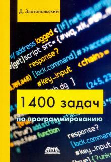

1400 Tasks
===================

Solving tasks from the book "1400 задач по программированию" (1400 programming tasks) Zlatopolsky Dmitry Mikhailovich (Candidate of Technical Sciences, Associate Professor)

****
